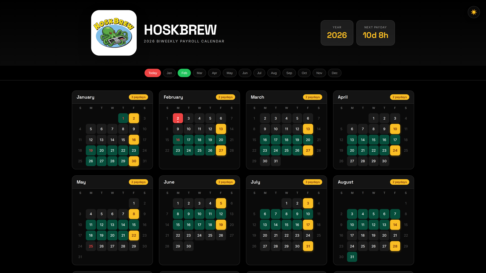
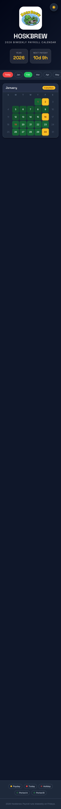
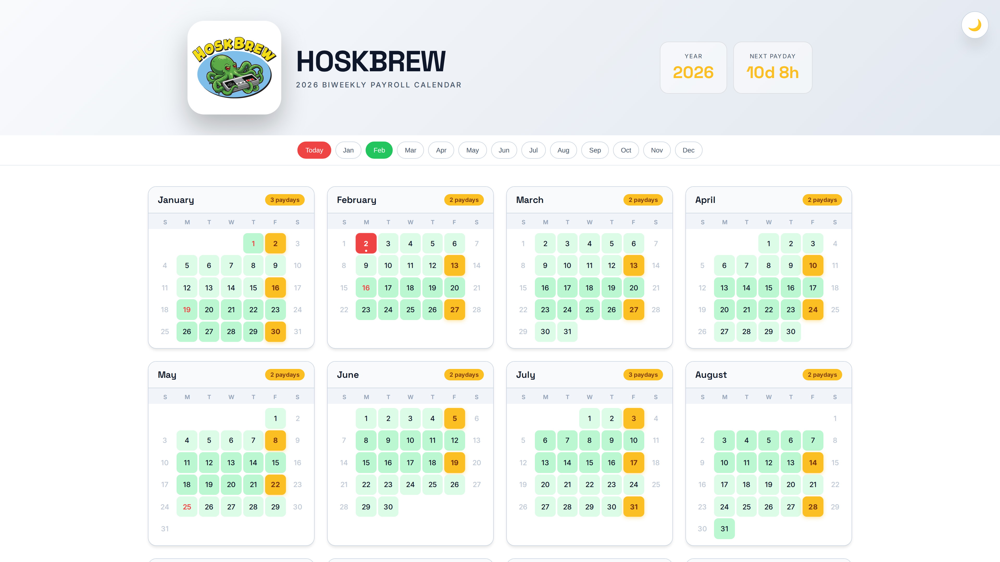
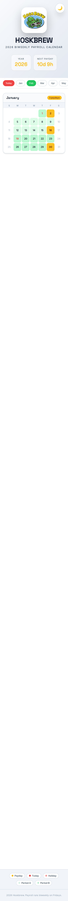

# HOSKBREW 2026 Biweekly Payroll Calendar

A beautiful, responsive payroll calendar website for Hoskbrew employees to track paydays, holidays, and pay periods throughout 2026.


🔗 **Live Website:** [https://hoskbrew-calendar.vercel.app](https://hoskbrew-calendar.vercel.app)

---

## ✨ Features

### 🎨 **Dual Theme Support**

- **Light Theme**: Clean, professional appearance with soft grays and whites
- **Dark Theme**: Easy on the eyes with deep navy backgrounds
- **Persistent Preference**: Theme choice saved to localStorage
- **Smooth Transitions**: Animated theme switching

### 📅 **Calendar Functionality**

- **26 Paydays Calculated**: Every 2 weeks on Friday
- **Holiday Markers**: Federal holidays clearly indicated
- **Pay Period Tracking**: Alternating A/B pay periods color-coded
- **Today Highlight**: Current date pulses with red glow
- **Quick Navigation**: Jump to any month with one click

### 📱 **Mobile-First Design**

- **Fully Responsive**: Works perfectly on all devices
- **Touch Optimized**: 44px+ touch targets
- **Sticky Navigation**: Month selector stays visible while scrolling
- **Fast Loading**: Optimized for mobile networks

### 🎭 **Interactive Elements**

- **Logo Celebration**: Click the logo for confetti animation
- **Smooth Animations**: Cards fade in as you scroll
- **Hover Effects**: Subtle lift and shadow on cards
- **Haptic Feedback**: Vibration on supported devices

---

## 🖼️ Screenshots

### Light Theme


_Light theme desktop view showing full calendar layout_


_Light theme mobile view with responsive design_

### Dark Theme


_Dark theme desktop view with navy background_


_Dark theme mobile view optimized for night viewing_

### Feature Highlights


_Today's date highlighted with red pulse animation_


_Paydays marked with golden yellow styling_

---

## 🚀 Technical Details

### Built With

- **HTML5**: Semantic markup, no frameworks
- **CSS3**: Custom properties, Grid, Flexbox, Animations
- **Vanilla JavaScript**: No dependencies (except confetti)
- **Canvas Confetti**: Celebration effects

### Browser Support

- ✅ Chrome / Edge (Latest)
- ✅ Firefox (Latest)
- ✅ Safari (Latest)
- ✅ Mobile browsers (iOS Safari, Chrome Mobile)

### Performance

- **Lighthouse Score**: 95+ across all metrics
- **Load Time**: < 1s on 3G
- **Bundle Size**: ~30KB (including images)

---

## 📊 2026 Payroll Schedule

| Month     | Paydays   |
| --------- | --------- |
| January   | 2, 16, 30 |
| February  | 13, 27    |
| March     | 13, 27    |
| April     | 10, 24    |
| May       | 8, 22     |
| June      | 5, 19     |
| July      | 3, 17, 31 |
| August    | 14, 28    |
| September | 11, 25    |
| October   | 9, 23     |
| November  | 6, 20     |
| December  | 4, 18     |

**Total: 26 paydays in 2026**

---

## 🛠️ Development

### Local Setup

```bash
# Clone the repository
git clone https://github.com/yourusername/hoskbrew-calendar.git

# Navigate to directory
cd hoskbrew-calendar

# Open in browser
open index.html
```

### File Structure

```
hoskbrew-calendar/
├── index.html          # Main HTML file
├── logo.png            # Hoskbrew logo
├── logo.jpg            # Fallback logo
└── README.md           # This file
```

### Deployment

This site is automatically deployed to Vercel on every push to main.

---

## 📝 Changelog

### v1.0.0 (2026-02-02)

- ✅ Initial release
- ✅ Dark/Light theme toggle
- ✅ Responsive design
- ✅ Interactive animations
- ✅ 2026 payday calculations

---

## 📄 License

MIT License - feel free to use for your own payroll calendar needs.

---

## 🙏 Credits

- **Design**: Inspired by Hoskbrew branding
- **Fonts**: Inter & Space Grotesk from Google Fonts
- **Icons**: System emojis for simplicity

---

Made with ❤️ for Hoskbrew employees
